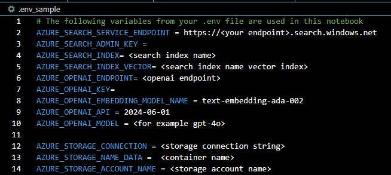

# Integrating AI Search in a RAG (Retrival Augumented Generation) pattern on Azure Data Manager for Energy Data (ADME). 


This codebase is made to help accelerate anyone who wants to use AI Search, and needs to create, populate and use AI Search with Azure OpenAI in Python. 

# Background

The codebase is part of a series where the aim is to enable Azure OpenAI services in combination with [Microsoft Azure Data Manager for Energy ](https://learn.microsoft.com/en-us/azure/energy-data-services/) data. The code include data from an open sourece dataset called NPD which contains factpages on Fields, Surveys and Wellbores.


# Prerequisites
You need to have access to a AI Search service and rights to create indexes and fill them with data. For example : **Search Service Contributor** and **Search Index Data Contributor**
You need access to an Azure OpenAI service if you plan to use vectors in the AI Search index or implement a RAG structure. 
If you want to import the test data they can be found in the data folder in this codebase. Unzipp the NPD.zip file and upload all the files to a container. 

The codebase use a .env file to link to all these services. 

# Azure OpenAI vs OpenAI and API key vs Entra ID login
This page shows good examples of how to switch between Azure OpenAI and OpenAI. It also shows how to switch between API Key and Entra ID login.

https://learn.microsoft.com/en-us/azure/ai-services/openai/how-to/switching-endpoints

In the code examples Entra ID is mostly used, but [search_no_vector_api_key.py](search_no_vector_api_key.py) uses API Key for those who might want to use it.

# How to Fork, Clone, and Set Up the Project

## 1. Fork the Repository
- Navigate to the repository on GitHub.
- Click the **Fork** button in the top-right corner of the page. This will create a copy of the repository in your GitHub account.

## 2. Clone the Repository Locally
- Go to your forked repository on GitHub.
- Click the **Code** button and copy the repository URL.
- Open your terminal and run the following command to clone the repository to your local machine:
    ```bash
    git clone https://github.com/your-username/repo-name.git
    ```
- Replace `your-username` and `repo-name` with your GitHub username and the repository name.

## 3. Navigate to the Project Folder
- Use the terminal to navigate into the newly cloned repository:
    ```bash
    cd repo-name
    ```

## 4. Create a Virtual Environment
- In the terminal, create a virtual environment:
    ```bash
    python -m venv venv
    ```
- Activate the virtual environment:
    - **Windows:**
        ```bash
        venv\Scripts\activate
        ```
    - **macOS/Linux:**
        ```bash
        source venv/bin/activate
        ```

## 5. Install the Dependencies
- Once the virtual environment is activated, install the project dependencies by running:
    ```bash
    pip install -r requirements.txt
    ```

## 6. Configuration
- Rename the .env_sample file to .env and fill out the variables in the file.



## 7. Run the Application
- You are now ready to run the application in your local environment! The code is presented in the order you need to build a RAG structure. Create index, populate index, chat in a RAG pattern. There are two paths, with and without vectors. Naturally 


## Part One - Creating an AI Search index
If you are using Azure Entra ID, then run `AZ Login` first. These examples will create indexes with **id**, **keyfield** (this is the key in the index and must be unique and have no special characters), **content**, **category**, **sourcepage**, **sourcefile**. Feel free to change these depending on your needs.


### Create an index with no vectors

This script [create_index_no_vector.py](code/create_index_no_vector.py) will create an index in your AI Search instance. 

### Create an index with vectors
This script [create_index_vector.py](create_index_vector.py) will create an index with a field ready for vectors: **contentVector** in addition to the other standard fields.


## Part Two - Populating an AI Search index
This code will populate AI Search index in the same format as used in the 'Creating an AI Search index' above

### Populate an index with no vectors
This script [populate_index_no_vector.py](populate_index_no_vector.py) will populate the AI Search index with no vector field created in the last part

### Populate an index with vectors
This script [populate_index_vector.py](populate_index_vector.py) will populate the AI Search index including the vector field. It uses Azure OpenAI to create the embeddings. 


## Part Three - Using AI Search in RAG pattern. With and without vectors, and with Entra ID and API Key
These examples will show a simple RAG (Retrieval Augumented Generation) structure. The user question is sent to AI Search, the documents returned are sent to Azure OpenAI and finally the answer from Azure OpenAI is sent to the user. 

### Search with no vectors
This script [search_no_vector.py](search_no_vector.py) shows an example on RAG with no vector on the index created earlier

### Search with vectors
This script [search_vector.py](search_vector.py) shows an example on RAG with vector on the index created earlier

### Search with no vector using API Key 
This script [search_no_vector_api_key.py](search_no_vector_api_key.py) similar to the no vector search code above, but shows the use of API Key instead of Entra ID